# Graviola Design System

✦ Graviola Feira Musical · Salvador, Bahia ✦

**Guia completo de identidade visual — cores, tipografia, componentes, padrões e voz da marca.**

✦ 2026 Edition ✦

---

## 1. Brand Logo & Identidade

### Logo Variations

| Variação | Descrição | Imagem |
|----------|-----------|--------|
| Principal | Logo wordmark padrão | 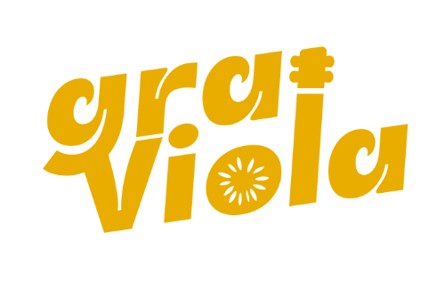 |
| Sobre Marrom | Logo em fundo marrom |  |
| Sobre Laranja | Logo em fundo laranja |  |
| Monocromático | Versão em uma cor |  |

---

## 2. Cores

### Paleta Primária

| Nome | Hex | Descrição |
|------|-----|-----------|
| Laranja Tropicália | `#FF7838` | Cor principal vibrante |
| Creme / Off-white | `#FFF4E9` | Fundo claro |
| Azul Céu | `#89C0FF` | Cor complementar fria |
| Amarelo Sol | `#FFD05D` | Destaque quente |
| Verde Folha | `#43A574` | Elemento natural |
| Marrom Terra | `#562D2A` | Tom escuro principal |

### Variações

**Laranja Tropicália**
- Light: `#FF9A68`
- Dark: `#D45A20`

**Azul Céu**
- Light: `#AECFFF`

**Amarelo Sol**
- Light: `#FFE08A`

**Verde Folha**
- Dark: `#26814E`

**Marrom Terra**
- Deep: `#321818`

### Paletas Alternativas

#### Noite de Verão
- Azul Profundo: `#1A3A59`
- Laranja Cítrico: `#F27405`
- Rosa Tropicália: `#D94177`
- Off-White: `#FAF9F6`

#### Terra e Sol
- Terracota: `#A64B29`
- Ocre: `#D99101`
- Verde Oliva: `#6B7335`
- Creme: `#FFF8E1`

### Semantic Color Tokens

```
bg-primary      → --color-creme (#FFF4E9)
bg-accent       → --color-laranja (#FF7838)
bg-cool         → --color-azul (#89C0FF)
bg-warm         → --color-amarelo (#FFD05D)
bg-nature       → --color-verde (#43A574)
bg-dark         → --color-marrom (#562D2A)
fg-primary      → --color-marrom (#562D2A)
fg-secondary    → #8A5A56
```

---

## 3. Tipografia

### Display — Lilita One

**Características:** Fonte display oficial com formas arredondadas, energia vibrante e lettering groovy.

**Uso:** Títulos, headlines, elementos de destaque

**Exemplos:**
- Graviola
- Feira Musical
- Cores, Sons e Sabores
- Trapiche Barnabé · Salvador ✦

### Body — Montserrat

| Escala | Tamanho | Peso | Uso |
|--------|---------|------|-----|
| H3 | 32px | 800 | Títulos secundários |
| H4 | 24px | 700 | Subtítulos |
| Subtitle | 18px | 600 | Legendas descritivas |
| Body | 16px | 400 | Texto principal |
| Body Italic | 16px | 400 italic | Texto enfatizado |
| Label | 11px | 700 | Labels e tags |
| Caption | 10px | 500 | Pequenos textos |

**Exemplos:**
- H3: "ARTISTAS 2026"
- H4: "Programação Completa"
- Subtitle: "Música · Artesanato · Gastronomia · Cultura"
- Body: "A Graviola é uma feira musical brasileira que une música, arte visual e experiências presenciais com raízes na cultura baiana."
- Body Italic: "Pitadas de cores, sons e sabores diretamente de Salvador para o seu coração."
- Label: "✦ Sua Data Aqui ✦"
- Caption: "Trapiche Barnabé · Salvador, Bahia · Brasil"

---

## 4. Componentes

### Botões

#### CTAs Principais
- Vem Viver!
- Garanta seu Ingresso
- Ver Programação

#### Secundários & Ação
- Saiba Mais
- Ver Mais
- Da Nossa Terra

#### Tamanho Pequeno
- Ingressos
- Programação
- Destaque
- Ver Mais

#### Variações por Contexto
- **Fundo Escuro (#321818):** Vem Viver! Pitadas ✦ Feira Musical

### Badges & Stamps

#### Pills
- Da Nossa Terra
- Tropicália
- Feira Musical
- Salvador · BA ✦ Graviola

#### Washi Tapes
- ✦ Vem Viver! ✦
- Pitadas de Cores
- Trapiche Barnabé
- ✦ SSA · 2026 ✦

#### Selos & Hexágono
- Da Nossa Terra (2026)
- Para o Coração
- Feira Musical
- Graviola
- Aquele Tempero
- SSA / Bahia · Brasil
- Feira Graviola (2026 Salvador)
- Feira Musical · 2026

### Cards

#### Card Evento


**Conteúdo:**
- Feira Musical **✦** SSA · BA
- ✦ Próxima Edição
- Trapiche Barnabé · Salvador, Bahia
- ✦ 08.10 · 16h ✦
- Uma feira musical brasileira
- 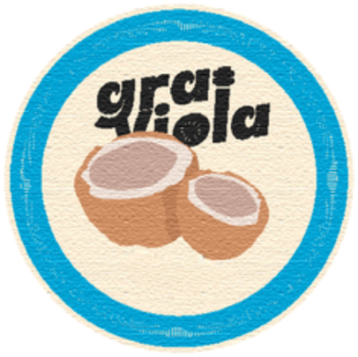

#### Card Escuro (Dark)


**Conteúdo:**
- ✦ Pitadas de ✦
- Cores, Sons & Sabores
- Música ao Vivo
- Artesanato
- Gastronomia
- Cultura Baiana
- 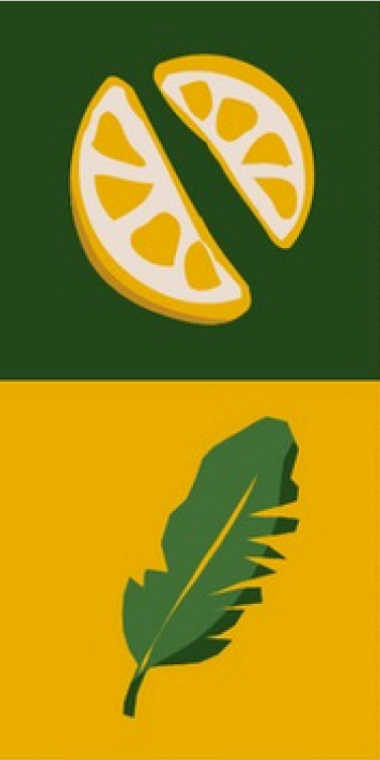
- Ingressos | Garança Já

#### Card Promocional
 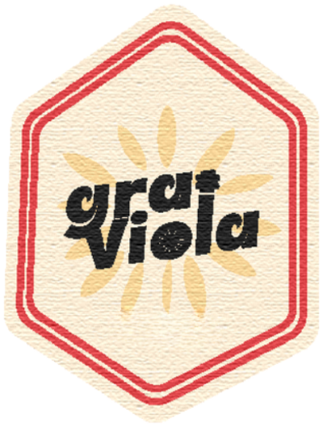

**Conteúdo:**
- Vem Viver!
- Feira musical a céu aberto — raízes na cultura baiana.
- Ingressos ✦

#### Card Brinde
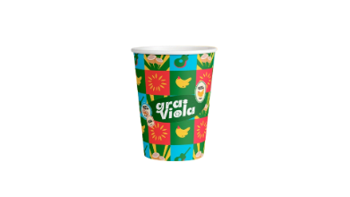
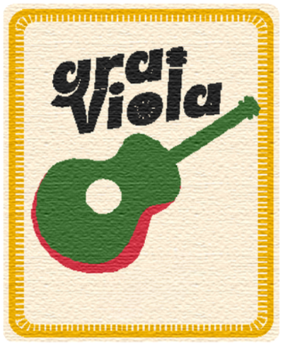

**Conteúdo:**
- ✦ Brinde Oficial ✦
- Coleção 2026
- Copo Graviola
- Trapiche Barnabé · SSA
- Quero o meu!

---

## 5. Espaçamento

### Spacing Scale (8px Grid)

| Escala | Valor (px) |
|--------|-----------|
| –1 | 4 |
| –2 | 8 |
| –3 | 12 |
| –4 | 16 |
| –5 | 20 |
| –6 | 24 |
| –8 | 32 |
| –10 | 40 |
| –12 | 48 |
| –16 | 64 |
| –20 | 80 |

### Border Radius

| Escala | Valor (px) |
|--------|-----------|
| sm | 6 |
| md | 12 |
| lg | 20 |
| xl | 32 |
| pill | 9999 |
| stamp | 50% |

### Shadows

- sm
- md
- lg
- orange
- inset

---

## 6. Brand Patches & Selos

| Formato | Descrição | Imagem |
|---------|-----------|--------|
| Circular · Coco | Bordado circular |  |
| Retangular · Violão | Bordado retangular |  |
| Hexagonal · Sol | Bordado hexagonal |  |
| Oval · Laranja | Bordado oval | 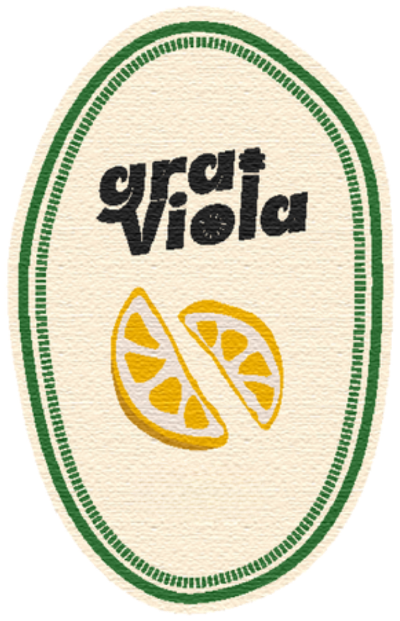 |

**Características:**
- 4 formatos em bordado artesanal sobre fundo creme
- Bordas costuradas características
- Circular (coco) · Retangular (violão) · Hexagonal (sol) · Oval (laranja)
- Uso em camisetas, bags, brindes e materiais digitais

---

## 7. Brand Pattern Design

### Tiles

| Padrão | Imagem |
|--------|--------|
| Banana · Sol | 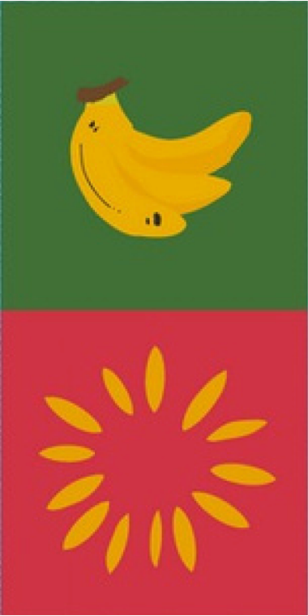 |
| Citrus · Folha |  |
| Vinil · Teclas | 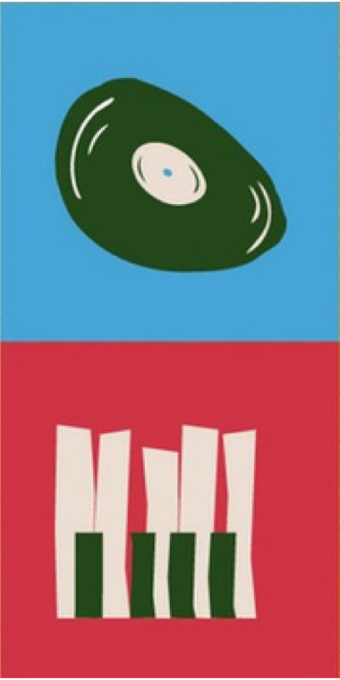 |
| Coco · Violão | 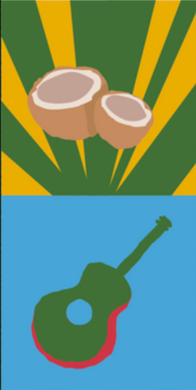 |

### Elementos

| Elemento | Imagem |
|----------|--------|
| Citrus | 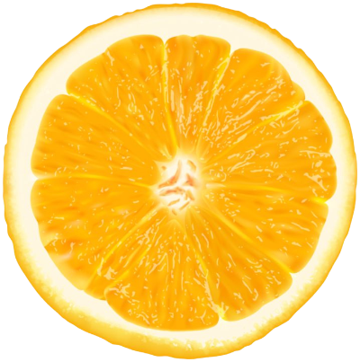 |
| Folha |  |
| Cavalete | 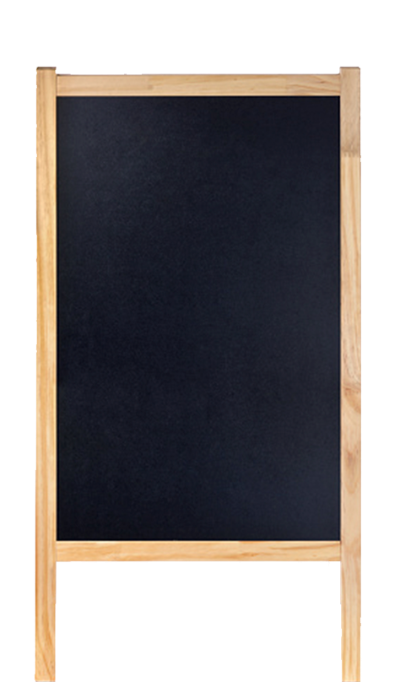 |
| Jornal | 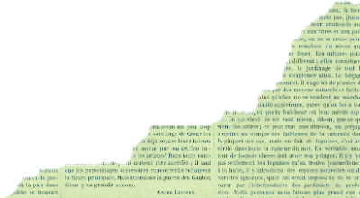 |

**Padrão Repeat: Tropical Pattern**

4 tiles 242×481px — ilustrações pop-art flat em fundos nas cores da marca.

---

## 8. Brand Texturas & Backgrounds

### Backgrounds

| Tipo | Imagem |
|------|--------|
| Amarelo Sol | 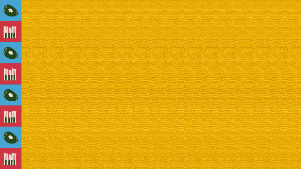 |
| Azul Céu | 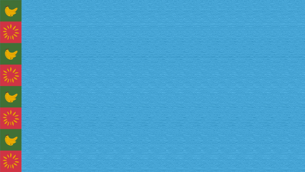 |
| Verde Folha | 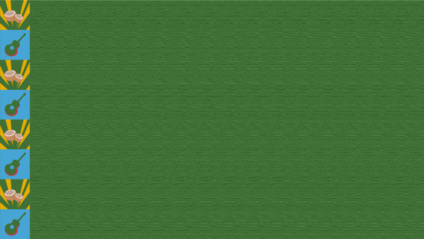 |
| Vermelho | 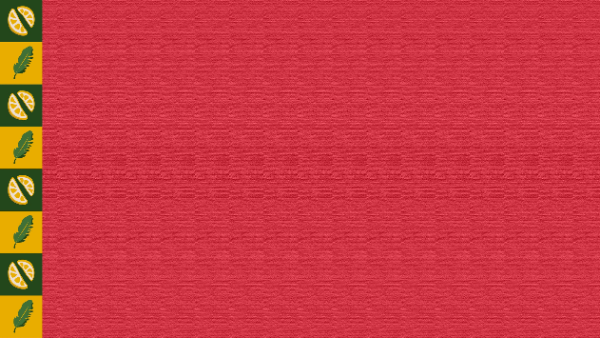 |
| Papel | 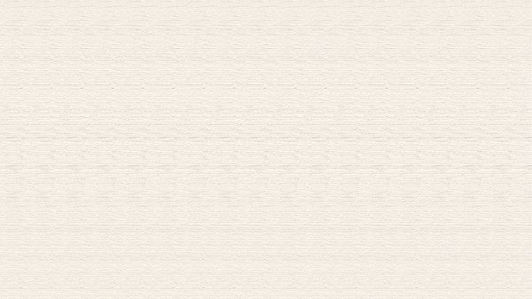 |

### Texturas & Elementos

| Textura | Imagem |
|---------|--------|
| Jornal Rasgado |  |
| Papel Kraft | 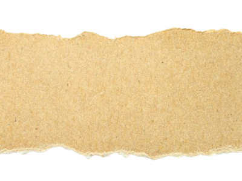 |
| Borda Rasgada |  |
| Faixa Tropical |  |

### Washi Tapes

*(Visual elements)*

---

## 9. Brand Dos & Don'ts

### ✓ O que fazer

- **Use a paleta oficial** — Aplique sempre as cores definidas neste guia.
- **Siga a direção de imagem** — Fotografias e ilustrações que reflectem a estética da Graviola.
- **Consistência tipográfica** — Lilita One para títulos, Montserrat para tudo mais.
- **Comunique com coerência** — Mensagem sempre alinhada aos valores da marca.

### ✕ O que evitar

- **Não altere o logo** — Sem distorção, recoloração ou modificação não autorizada.
- **Não use cores fora da paleta** — Apenas as cores definidas na identidade visual.
- **Não misture elementos indevidos** — Use os gráficos de forma consistente.
- **Não use mensagens contraditórias** — Evite comunicações que obscureçam a identidade.

---

## 10. Brand Voz & Tom

### Voz & Tom

**Calorosa e popular**
Fala como quem convida para um encontro cheio de arte e ritmo.

**Brasileira de verdade**
Valoriza expressões e referências culturais vivas, sem afetação.

**Leve e com atitude**
Mistura leveza, ritmo e uma pitada de personalidade.

**Nunca fria ou corporativa**
Próxima, autêntica, sempre reforçando experiência e brasilidade.

---

## 11. Brand Aplicações da Marca

| Aplicação | Imagem |
|-----------|--------|
| Copo |  |
| Pulseira | 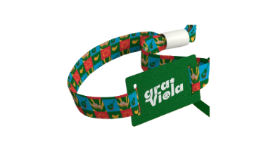 |
| Lambe-lambe / OOH | 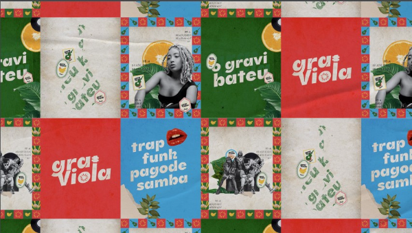 |

---

## 12. Social Media — Base Templates

### Templates (6 variações)

| Template | Imagem |
|----------|--------|
| Template 01 |  |
| Template 02 | 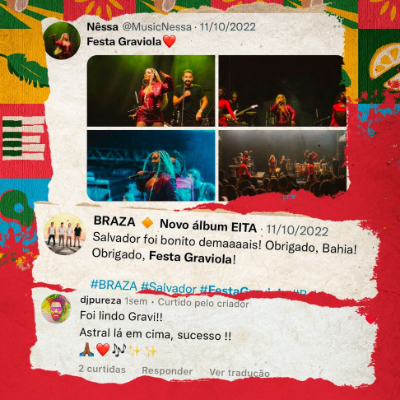 |
| Template 03 | 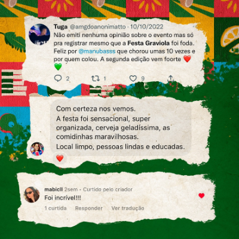 |
| Template 04 | 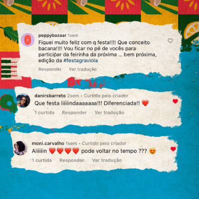 |
| Template 05 | 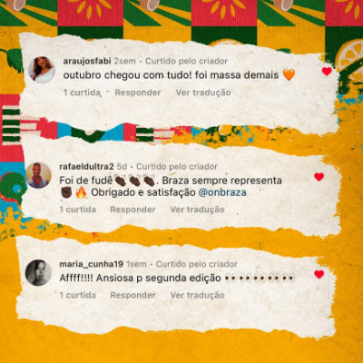 |
| Template 06 | 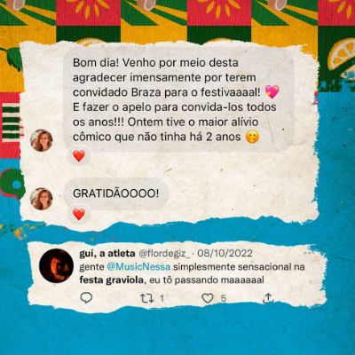 |

**Descrição:**
6 variações de post (1:1) para redes sociais. Colagem editorial com elementos da marca.

### Social Post Preview

| Post | Avatar | Handle | Imagem | Engajamento |
|------|--------|--------|--------|-------------|
| Post 1 | G | @festagraviola |  | ♡ 342 ↻ 87 |
| Post 2 | G | @festagraviola |  | ♡ 512 ↻ 134 |
| Post 3 | G | @festagraviola |  | ♡ 289 ↻ 61 |
| Post 1B | G | @festagraviola |  | ♡ 198 ↻ 43 |

---

**Última atualização:** 2026 Edition
