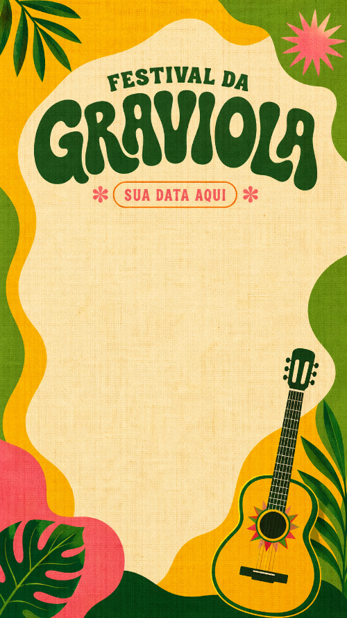
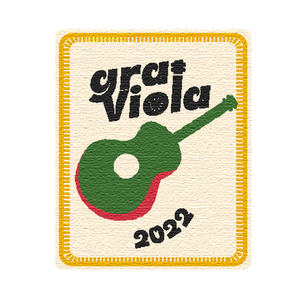
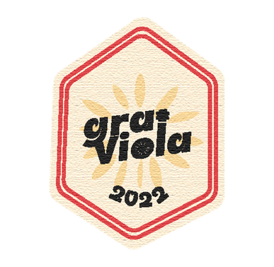

Graviola — Pitch Deck Patrocínio Master | PetroReconcavo :root { --cream: #FFF4E9; --maroon: #321818; --orange: #FF7838; --orange-text: #E05A20; /\* accessible orange for text on cream (3.1:1 contrast) \*/ --green: #4A7C59; --muted: #A89A93; --cream-dk: #D4C6BA; /\* RGB components for alpha compositing \*/ --maroon-rgb: 50, 24, 24; --orange-rgb: 255, 120, 56; --green-rgb: 74, 124, 89; --cream-rgb: 255, 244, 233; } \*, \*::before, \*::after { box-sizing: border-box; margin: 0; padding: 0; } body { background: #111; font-family: 'Montserrat', sans-serif; overflow: hidden; display: flex; flex-direction: column; align-items: center; justify-content: center; height: 100vh; } /\* ── DECK CONTAINER ── \*/ #deck { position: relative; width: 100vw; height: 100vh; overflow: hidden; } /\* ── SLIDE BASE ── \*/ .slide { position: absolute; inset: 0; width: 100%; height: 100%; display: none; flex-direction: column; justify-content: center; align-items: flex-start; padding: 80px 120px; background: var(--cream); opacity: 0; transition: opacity 0.4s ease; overflow: hidden; } .slide.active { display: flex; opacity: 1; } .slide.pivot { background: var(--maroon); --orange-text: var(--orange); } .slide.immersive { padding: 0; } /\* ── TYPOGRAPHY ── \*/ .h1 { font-family: 'Lilita One', sans-serif; font-size: clamp(48px, 5.5vw, 96px); color: var(--maroon); line-height: 1.1; } .h2 { font-family: 'Lilita One', sans-serif; font-size: clamp(36px, 4vw, 72px); color: var(--maroon); line-height: 1.15; } .h3 { font-family: 'Montserrat', sans-serif; font-size: clamp(20px, 2.2vw, 36px); font-weight: 600; color: var(--maroon); line-height: 1.3; } .body { font-size: clamp(14px, 1.4vw, 22px); line-height: 1.6; color: var(--maroon); } .label { font-size: clamp(11px, 0.9vw, 15px); font-weight: 600; letter-spacing: 0.1em; text-transform: uppercase; color: var(--muted); } .text-cream { color: var(--cream) !important; } .text-orange { color: var(--orange-text) !important; } .text-muted { color: var(--cream-dk) !important; } .text-green { color: var(--green) !important; } /\* ── LAYOUT HELPERS ── \*/ .row { display: flex; align-items: center; gap: 40px; width: 100%; } .col { display: flex; flex-direction: column; gap: 24px; } .col-half { flex: 1; } .spacer-sm { height: 16px; } .spacer-md { height: 32px; } .spacer-lg { height: 48px; } /\* ── DIVIDER ── \*/ .divider { width: 320px; height: 3px; background: var(--orange); margin: 24px 0; } .divider-full { width: 100%; height: 1px; background: rgba(var(--maroon-rgb),0.15); margin: 32px 0; } /\* ── BADGE / CHIP ── \*/ .badge { display: inline-block; background: var(--orange); color: var(--cream); font-size: 13px; font-weight: 700; letter-spacing: 0.06em; padding: 6px 18px; border-radius: 4px; text-transform: uppercase; } .badge-outline { background: transparent; border: 2px solid var(--orange); color: var(--orange-text); } /\* ── BULLET LIST ── \*/ .bullets { list-style: none; display: flex; flex-direction: column; gap: 18px; } .bullets li { display: flex; align-items: flex-start; gap: 16px; font-size: clamp(14px, 1.3vw, 20px); color: var(--maroon); line-height: 1.5; } .bullets li::before { content: ''; display: block; width: 6px; height: 6px; border-radius: 50%; background: var(--orange); margin-top: 9px; flex-shrink: 0; } .bullets.cream li { color: var(--cream); } .bullets.cream li::before { background: var(--orange); } /\* ── HERO NUMBERS (S11) ── \*/ .hero-number { font-family: 'Lilita One', sans-serif; font-size: clamp(64px, 8vw, 140px); line-height: 1; } /\* ── TABLE ── \*/ .table-exec { width: 100%; border-collapse: collapse; } .table-exec th { background: var(--cream); color: var(--maroon); font-size: 13px; font-weight: 700; letter-spacing: 0.08em; text-transform: uppercase; padding: 14px 20px; text-align: left; border-bottom: 2px solid var(--orange); } .table-exec td { padding: 16px 20px; font-size: clamp(13px, 1.1vw, 17px); border-bottom: 1px solid rgba(var(--maroon-rgb),0.1); color: var(--maroon); vertical-align: top; } .table-exec tr:last-child td { border-bottom: none; } .table-exec tr:hover td { background: rgba(var(--orange-rgb),0.04); } .pivot-table th { background: rgba(var(--cream-rgb),0.08); color: var(--cream-dk); border-bottom-color: var(--orange-text); } .pivot-table td { color: var(--cream); border-bottom-color: rgba(var(--cream-rgb),0.12); } /\* ── CHECKMARKS ── \*/ .checklist { list-style: none; display: flex; flex-direction: column; gap: 16px; } .checklist li { display: flex; align-items: center; gap: 16px; font-size: clamp(14px, 1.2vw, 19px); } .checklist li::before { content: '✓'; display: flex; align-items: center; justify-content: center; width: 28px; height: 28px; background: var(--orange); color: white; border-radius: 50%; font-size: 14px; font-weight: 700; flex-shrink: 0; } /\* ── FULL-BLEED IMAGE ── \*/ .bg-cover { position: absolute; inset: 0; width: 100%; height: 100%; object-fit: cover; } .overlay { position: absolute; inset: 0; } .slide-content { position: relative; z-index: 2; width: 100%; height: 100%; display: flex; flex-direction: column; justify-content: center; padding: 80px 120px; } /\* ── FOOTER ── \*/ .slide-footer { position: absolute; bottom: 32px; left: 120px; right: 120px; display: flex; justify-content: space-between; align-items: center; font-size: 12px; font-weight: 500; letter-spacing: 0.06em; color: var(--muted); z-index: 10; text-transform: uppercase; } .slide-footer.light { color: rgba(var(--cream-rgb),0.4); } /\* ── SLIDE NUMBER ── \*/ .slide-num { position: absolute; top: 62px; right: 48px; font-size: 13px; font-weight: 600; color: var(--muted); z-index: 10; } .slide-num.light { color: rgba(var(--cream-rgb),0.35); } /\* ── NAVIGATION ── \*/ #nav { position: fixed; bottom: 20px; left: 50%; transform: translateX(-50%); display: flex; gap: 12px; align-items: center; background: rgba(var(--maroon-rgb),0.9); backdrop-filter: blur(8px); padding: 10px 24px; border-radius: 40px; z-index: 100; color: var(--cream); font-size: 13px; font-weight: 500; } #nav button { background: none; border: none; cursor: pointer; color: var(--cream); font-size: 18px; padding: 0 4px; opacity: 0.7; transition: opacity 0.2s; } #nav button:hover { opacity: 1; } #counter { min-width: 70px; text-align: center; font-weight: 600; } /\* ── SECTION LABEL ── \*/ .section-tag { display: inline-block; background: var(--orange); color: white; font-size: 11px; font-weight: 700; letter-spacing: 0.1em; text-transform: uppercase; padding: 4px 12px; border-radius: 3px; margin-bottom: 20px; } /\* ── SPLIT LAYOUT ── \*/ .split { display: flex; width: 100%; height: 100%; } .split-left { flex: 1.1; display: flex; flex-direction: column; justify-content: center; padding: 80px 80px 80px 120px; } .split-right { flex: 0.9; display: flex; align-items: center; justify-content: center; padding: 40px; background: rgba(var(--maroon-rgb),0.04); } /\* ── ONSHORE LOUNGE CARD ── \*/ .lounge-card { background: rgba(var(--orange-rgb),0.12); border: 2px solid var(--orange); border-radius: 8px; padding: 40px; width: 100%; } /\* ── HIGHLIGHT NUMBER ── \*/ .stat-block { display: flex; flex-direction: column; gap: 6px; } .stat-num { font-family: 'Lilita One', sans-serif; font-size: clamp(40px, 4.5vw, 72px); color: var(--orange-text); line-height: 1; } .stat-label { font-size: 14px; font-weight: 600; color: var(--maroon); text-transform: uppercase; letter-spacing: 0.08em; } /\* ── TIMELINE ── \*/ .timeline { display: flex; gap: 0; width: 100%; } .timeline-item { flex: 1; display: flex; flex-direction: column; align-items: center; position: relative; } .timeline-item:not(:last-child)::after { content: ''; position: absolute; top: 18px; left: 50%; width: 100%; height: 2px; background: var(--orange); opacity: 0.4; } .timeline-dot { width: 36px; height: 36px; background: var(--orange); border-radius: 50%; display: flex; align-items: center; justify-content: center; color: white; font-size: 13px; font-weight: 700; position: relative; z-index: 1; } .timeline-label { font-size: 12px; font-weight: 600; text-align: center; margin-top: 12px; color: var(--maroon); text-transform: uppercase; letter-spacing: 0.06em; } .timeline-date { font-size: 11px; color: var(--muted); text-align: center; margin-top: 4px; } /\* ── PAPER TEXTURE (cream slides) ── \*/ .slide:not(.pivot):not(.immersive) { background-image: url('src/assets/brand_bg.jpg'); background-size: cover; background-blend-mode: multiply; } /\* ── DECORATIVE PATCHES ── \*/ .deco { position: absolute; pointer-events: none; z-index: 1; opacity: 0.88; } /\* ── TROPICAL STRIP — topo dos slides cream ── \*/ .slide:not(.pivot):not(.immersive)::before { content: ''; position: absolute; top: 0; left: 0; right: 0; height: 56px; background-image: url('src/assets/graviola_pattern_tropical.png'); background-repeat: repeat-x; background-size: auto 56px; z-index: 3; pointer-events: none; } /\* ── TROPICAL OVERLAY — textura fantasma nos slides cream ── \*/ .slide:not(.pivot):not(.immersive)::after { content: ''; position: absolute; inset: 0; background-image: url('src/assets/graviola_pattern_tropical.png'); background-repeat: repeat; background-size: 260px auto; opacity: 0.04; pointer-events: none; } /\* ── PATTERN ACCENT — rodapé dos slides pivô (exceto S11) ── \*/ .slide.pivot:not(.pure)::after { content: ''; position: absolute; bottom: 0; left: 0; right: 0; height: 44px; background-image: url('src/assets/graviola_pattern_tropical.png'); background-repeat: repeat-x; background-size: auto 44px; opacity: 0.14; pointer-events: none; } /\* ── KEYBOARD NAV ── \*/ body:focus { outline: none; }

# GRAVIOLA

Feira Musical Brasileira

Proposta de Patrocínio — Cota Master

PetroReconcavo • Salvador, Bahia • 2026

Breeze House Company PRONAC 495329 — Aprovado MinC/SALIC

O Festival

A energia de  
Graviola
=======================

5.000

Pessoas

270

Alunos capacitados

1ª

Edição — 2026

- Festival imersivo de música regional baiana e vanguarda
- Artistas locais e nacionais com raízes na Bahia
- Uma experiência que conecta cultura, juventude e território

Breeze House Company02 / 30

03 / 30

Autoridade Legal

PRONAC

# 495329

Ministério da Cultura • SALIC — Sistema de Apoio às Leis de Incentivo à Cultura

- Publicado no Diário Oficial da União
- Isenção de IR garantida por lei federal
- Conformidade total com a Lei 8.313/91
- Risco institucional: **zero**

Este não é um projeto de festa. É um ativo fiscal federal aprovado.

Breeze House Company

04 / 30

Por que PetroReconcavo

O território de vocês,  
nossa plataforma.

---

- PetroReconcavo opera **onshore na Bahia** — nas mesmas praças onde Graviola acontece
- A empresa já investe em **relacionamento comunitário** e educação regional
- Graviola nasce exatamente onde a empresa cria valor e precisa de Brand Love

O alinhamento estratégico

ESG + Cultura + Território

Uma sinergia territorial que nenhum outro festival em Salvador pode oferecer.

Breeze House Company

05 / 30

A Oportunidade

A lacuna educacional  
da Geração Z baiana.

---

270

Alunos sem acesso

0

Programas criativos existentes

2026

Janela de entrada

- Jovens de 18–35 anos sem acesso a treinamento em **economia criativa**
- Mercado cultural baiano em expansão — demanda por formação profissional crescente
- **Graviola preenche esse gap** com ação formativa estruturada e certificada
- PetroReconcavo assina esse impacto junto — e o leva para seu Relatório de Sustentabilidade

Breeze House Company

06 / 30

Timing Estratégico

Primeiros a chegar.  
Primeiros na narrativa.

---

- Marcas que chegam em festivais de **primeira edição dominam a narrativa** de longo prazo
- Custo de entrada incomparável vs. festivais consolidados
- Nenhum concorrente com posicionamento ESG+Cultural em Salvador em 2026

A pergunta certa

"Por quanto tempo o protagonismo absoluto ainda está disponível?"

Breeze House Company

07 / 30

A Solução

Graviola como  
resposta integrada.

---

Entretenimento

5.000

pessoas, lineup regional de força

Educação

270

alunos capacitados em economia criativa

Brand Elevation

Onshore  
First

logo na vanguarda cultural da Bahia

Tributário

R$ 0

custo real via 100% dedução IR

Breeze House Company

08 / 30

Bloco Tributário

Lei Rouanet —  
a mecânica do investimento.

---

A **Lei Federal 8.313/91** (Programa Nacional de Apoio à Cultura) cria um mecanismo de incentivo fiscal onde empresas do Lucro Real destinam parte do IR — que iria ao governo — para projetos culturais aprovados.

O projeto **já está aprovado** pelo Ministério da Cultura. O caminho está pavimentado.

Como funciona em 3 passos

1.  1

    Empresa apura o IR sobre o Lucro Real

2.  2

    Destina parte do IR para o Graviola (projeto aprovado)

3.  3

    100% deduzido — custo efetivo = **R$ 0**

Breeze House Company • Lei 8.313/91

09 / 30

Art. 18 — Incentivo Fiscal

Como funciona  
o Artigo 18.

---

Dedução máxima

Até 4%

do IR devido no exercício fiscal

Retorno do valor doado

100%

retorna como dedução integral do IR

O raciocínio fiscal em uma frase:

"O recurso que iria ao Tesouro Nacional passa a financiar cultura baiana — com naming rights da PetroReconcavo em todo o festival."

Breeze House Company • Lei 8.313/91

10 / 30

Estrutura de Custos

## Simulação financeira.

Item

Valor

Observação

Orçamento total aprovado do Graviola

**R$ 199.579,79**

Aprovado MinC / SALIC

Cota Master (50% do projeto)

**R$ 100.000,00**

Naming Rights exclusivos

Dedução via Art. 18 (Lucro Real)

– R$ 100.000,00

100% do valor doado

**Custo efetivo para PetroReconcavo**

**R$ 0,00**

**Realocação de imposto**

Breeze House CompanyPRONAC 495329

11 / 30

Cota Master — Lei Rouanet Art. 18

R$ 100.000

Valor Nominal

→

R$ 0

Custo Efetivo

É uma realocação de imposto — não um gasto novo.

100% do valor é deduzido do Imposto de Renda (Lucro Real).  
O recurso que iria ao Tesouro Nacional financia cultura baiana.

PRONAC 495329 • Aprovado MinC/SALIC • Publicado no Diário Oficial da União

Breeze House Company

12 / 30

Garantias

Risco minimizado.  
Garantias legais.

---

- PRONAC 495329 aprovado e publicado no DOU
- Conformidade total com a Lei 8.313/91
- Prestação de contas via sistema SALIC (federal)
- Seguro de Responsabilidade Civil incluso
- Relatório de impacto pós-evento entregue

Breeze House Company

Produtora cultural sediada em Salvador, especialista em projetos via Lei Rouanet com **múltiplos projetos aprovados** e histórico comprovado de execução.

Breeze House Company

13 / 30

Prova Artística

## O lineup — credibilidade artística.

- Artistas regionais baianos com base consolidada de fãs
- Mix: MPB contemporânea, axé raiz, forró e música de vanguarda
- Curadoria focada em **representatividade e qualidade artística**
- Headliners confirmados progressivamente até fechamento da captação

Seleção de Artistas

A grade prioriza **artistas baianos emergentes e consolidados** com potencial de audiência regional e alcance digital.

Breeze House Company

14 / 30

Venue

## Trapiche Barnabé.

Salvador, Bahia — Centro Histórico

- Localização icônica no coração histórico de Salvador
- Capacidade para **5.000 pessoas** com infraestrutura completa
- Espaço que já recebeu grandes shows e eventos corporativos
- Acesso, segurança e logística de classe A

5k

Capacidade

A+

Infraestrutura

1

Palco principal + espaços secundários

Breeze House Company

15 / 30

Audiência

## Quem vai estar lá.

5.000

Pessoas esperadas

Jovens de 18–35 anos, classe média/alta, Salvador e região

50k+

Impressões orgânicas

Estimativa de alcance em redes sociais durante o evento

90%

Afinidade com marcas culturais

Alta propensão a apoiar marcas que investem em cultura local

Breeze House Company

16 / 30

Estratégia de Mídia

Cobertura de imprensa  
regional.

---

- Assessoria de imprensa focada em veículos baianos (TV, rádio, digital)
- Parcerias com criadores de conteúdo e influenciadores regionais
- Clipping de PR estimado: **R$ 150.000+** em mídia espontânea
- PetroReconcavo mencionada como patrocinadora em **toda cobertura**

Retorno de Mídia Estimado

R$ 150k+

em mídia espontânea — para um investimento efectivo de R$ 0

Relatório de clipping entregue pós-evento

Breeze House Company

17 / 30

Prova Social

## Endossos e credibilidade.

Aprovação Institucional

O Ministério da Cultura confirma a qualidade e viabilidade do projeto via aprovação no SALIC.

Plano Nacional de Cultura

O Graviola está alinhado com as políticas culturais nacionais de democratização do acesso e fomento regional.

Normas ABNT

Contrapartidas educacionais seguem normas de acessibilidade (ABNT NBR 9050) — compatíveis com relatórios ESG.

"Primeira edição não significa risco — significa **oportunidade de protagonismo antes da concorrência chegar.**"

Breeze House Company

18 / 30

Cronograma

## Timeline de execução.

1

Captação

Abr–Jul 2026

2

Lineup & Venue

Mai–Jun 2026

3

Pré-produção

Jul–Out 2026

★

FESTIVAL

Nov 2026

5

Prestação SALIC

Dez 26–Fev 27

6

Relatório ESG

Jan 2027

O prazo de captação encerra em julho de 2026. Cotas não reservadas nesse período serão abertas a outros patrocinadores.

Breeze House Company

19 / 30

A Oferta

## Cota Master — o que você compra.

Contrapartida

Detalhe

Valor de Mercado

**Naming Rights**

Logo em destaque em todos os materiais (digital + físico)

Exclusivo

**Sinalética no Venue**

Palco, entrada, área VIP — identidade visual total

Alta exposição

**20 Ingressos VIP**

Camarote Master + serviço premium

R$ 8.000+

**Parceria Educacional**

Co-patrocinadora da Oficina — 270 alunos certificados

Impacto ESG real

**Relatório de Impacto**

Dados para Relatório de Sustentabilidade da empresa

Compliance

**Cobertura de Imprensa**

Menção em 50+ veículos de comunicação regional

R$ 150k+ PR

**Investimento Cota Master**

**R$ 100k → R$ 0**

Breeze House CompanyPRONAC 495329

20 / 30

Exposição de Marca

Naming Rights &  
presença de marca.

---

- **Logo em posição de destaque** no cartaz oficial, redes sociais e press kit
- Crédito verbal em todas as comunicações de imprensa
- Banner e sinalização física no Trapiche Barnabé
- Menção em releases para **50+ veículos** de comunicação regional
- Presença em todo conteúdo de social media do festival

Simulação de visibilidade

50k+

impressões de marca durante o evento

\+ cobertura de imprensa regional estimada em 150k+ alcance

Breeze House Company

21 / 30

Ativação de Relacionamento

Camarote Master  
& ativação VIP.

---

- **20 ingressos VIP** para diretores, executivos e parceiros estratégicos
- Área exclusiva com identidade visual da PetroReconcavo
- Catering premium com branding da empresa
- Oportunidade de **endomarketing** com equipe onshore da Bahia

Oportunidade estratégica

O camarote é também uma **ferramenta de endomarketing**: aproximar sua equipe onshore da identidade cultural da Bahia fortalece pertencimento e orgulho de marca internamente.

Breeze House Company

22 / 30

Impacto Social

Parceria educacional —  
270 alunos.

---

Escolas públicas de Salvador

- **Oficina de Economia Criativa:** 3 dias, 6h por dia
- Conteúdo: empreendedorismo criativo, produção cultural, mercado de trabalho
- Certificação emitida em nome do projeto e **co-assinada pelo patrocinador**
- Dados nominais e fotos para relatório ESG da empresa

Impacto Mensurável ESG

270

jovens capacitados documentados com nome, presença e certificação

Indicador direto para relatório de sustentabilidade

Breeze House Company

23 / 30

Resumo da Oferta

## Tudo que vocês recebem.

- ✓ Naming Rights em todo material do festival
- ✓ Sinalização exclusiva no Trapiche Barnabé
- ✓ 20 Ingressos VIP + Camarote Master

- ✓ Co-patrocínio da Oficina Educacional (270 alunos)
- ✓ Relatório de Impacto ESG pós-evento
- ✓ Menção em 50+ veículos de comunicação

Investimento

R$ 100.000

→

Custo Efetivo

R$ 0

Breeze House Company

24 / 30

Perguntas Frequentes

## Antecipando objeções.

É a primeira edição — qual o risco?

Projeto federal aprovado (PRONAC 495329), produtora experiente, venue consolidado (Trapiche Barnabé). O risco é mitigado por garantias institucionais.

Como comprovo a dedução para o fisco?

O SALIC emite **recibo oficial de mecenato** diretamente ao patrocinador, compatível com a escrituração fiscal do Lucro Real.

E se o evento não acontecer?

Recursos geridos via SALIC com prestação de contas federal. Em caso de cancelamento, o SALIC orienta o processo de devolução conforme a legislação.

Podemos customizar a cota?

Sim, dentro dos limites do orçamento aprovado. Podemos ajustar a composição de contrapartidas para maximizar o alinhamento ESG da empresa.

Breeze House Company

25 / 30

Execução

## Cronograma executivo.

Abr

Captação de recursos

Início da prospecção

Mai

Lineup & Venue

Contratos artísticos

Jul

Fechamento de cotas

⚠ Prazo final

Set

Divulgação & vendas

Campanhas digitais

Nov

FESTIVAL

Trapiche Barnabé

Jan

Relatório de impacto

ESG + SALIC

**Atenção:** O prazo de reserva da Cota Master é **julho de 2026**. Posições não confirmadas serão abertas ao mercado.

Breeze House Company

26 / 30

Governança

## O que entregamos depois.

Indicador

Dado Entregue

Uso no ESG

Audiência do evento

Número real de participantes

Impacto cultural comunitário

Alunos capacitados

270 nomes + presenças + fotos

Indicador educacional SDG 4

Retorno de mídia

Clipping completo com valor estimado

Retorno de marca institucional

Documentação SALIC

Recibo oficial de mecenato

Compliance tributário

Prestação de contas

Relatório federal via SALIC

Transparência e governança

Todos os dados são entregues em formato compatível com frameworks ESG (GRI, SASB) e com o Relatório de Sustentabilidade da PetroReconcavo.

Breeze House Company

27 / 30

Compliance

Garantias & compliance  
corporativo.

---

- Seguro de Responsabilidade Civil para o evento
- Conformidade com Lei 8.313/91 e regulamentações SALIC
- Prestação de contas mensal via sistema federal
- Transparência total — PetroReconcavo acompanha execução

Monitoramento

- Relatórios periódicos de avanço de produção
- Acesso ao painel SALIC da empresa patrocinadora
- Canal direto com o Produtor Executivo

Breeze House Company

28 / 30

Quem Executa

## Breeze House Company.

Produção cultural · Salvador, Bahia

- Produtora cultural sediada em Salvador — **especialista em Lei Rouanet**
- Múltiplos projetos aprovados no SALIC
- Equipe: Coordenador Geral + Produtor Executivo + Coordenador de Marketing
- Parceiros: assessoria de imprensa, produção técnica, segurança e logística

Gabriel Magalhães

Founder & Produtor Executivo

gmagalhaes9652@gmail.com

Breeze House Company

29 / 30

Ativação Exclusiva

## Sintonia Onshore.

Uma ativação pensada do zero para a PetroReconcavo — não é uma cota genérica com logotipo. É uma experiência que reflete quem vocês são.

O Lounge Sintonia Onshore

- Espaço VIP com identidade "em terra" — referência ao trabalho onshore da empresa
- Decoração que celebra a presença da PetroReconcavo na Bahia
- Convites prioritários para colaboradores das operações baianas

A empresa não é patrocinadora.

É protagonista.

Breeze House Company

30 / 30

# Vamos conversar?

15 minutos é suficiente para mudar como você vê esse imposto.

Próximo passo

Reunião de 15 min via Meet / Teams

Em seguida

Deck completo para análise do Comitê

Prazo para resposta

Até julho de 2026

Gabriel Magalhães

gmagalhaes9652@gmail.com

Breeze House Company

Salvador, Bahia — 2026

PRONAC

495329

Breeze House CompanyGraviola — Feira Musical Brasileira

‹ 1 / 30 ›

let cur = 0; const slides = document.querySelectorAll('.slide'); const counter = document.getElementById('counter'); const total = slides.length; function show(n) { slides\[cur\].classList.remove('active'); cur = (n + total) % total; slides\[cur\].classList.add('active'); counter.textContent = \`${cur + 1} / ${total}\`; } function go(d) { show(cur + d); } document.addEventListener('keydown', e => { if (e.key === 'ArrowRight' || e.key === 'ArrowDown' || e.key === ' ') go(1); if (e.key === 'ArrowLeft' || e.key === 'ArrowUp') go(-1); if (e.key === 'Home') show(0); if (e.key === 'End') show(total - 1); // Jump to pivots if (e.key === '3') show(2); if (e.key === '!') show(10); // Shift+1 → S11 if (e.key === '9') show(18); }); // Touch/swipe let tx = 0; document.addEventListener('touchstart', e => { tx = e.touches\[0\].clientX; }); document.addEventListener('touchend', e => { const dx = e.changedTouches\[0\].clientX - tx; if (Math.abs(dx) > 50) go(dx < 0 ? 1 : -1); });